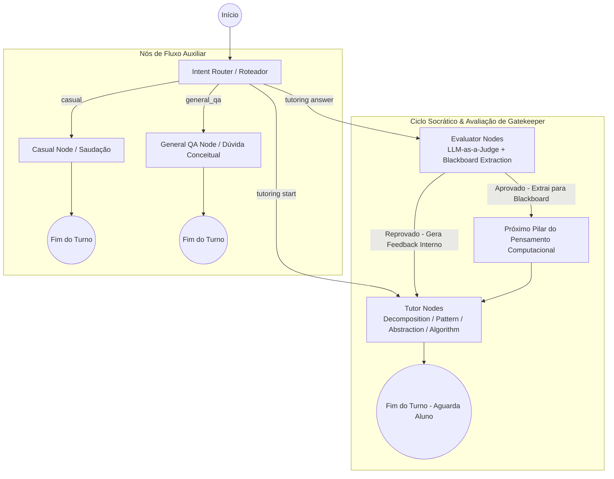

# Socratic Wing Tutor: Agente Estocástico de Tutoria baseado no Pensamento Computacional com LangGraph

[](https://langchain-ai.github.io/langgraph/)
[](https://python.langchain.com/)
[](https://www.python.org/)
[](https://ai.google.dev/)
[](https://docs.confident-ai.com/)
[](https://opensource.org/licenses/MIT)

O **Socratic CT-Tutor** é um sistema computacional estocástico multi-agente e orquestrado, baseado no paradigma do **Pensamento Computacional (Computational Thinking - CT)** e implementado utilizando **LangGraph** e modelos de linguagem de grande escala (LLMs). 

O objetivo primordial deste sistema não é fornecer respostas prontas ou códigos finalizados ao estudante, mas sim atuar através do **método socrático**, guiando o aluno na fragmentação, modelagem e resolução de problemas complexos de programação através dos quatro pilares fundamentais: **Decomposição**, **Reconhecimento de Padrões**, **Abstração** e **Algoritmos**.

---

## Arquitetura do Sistema: Padrão Tutor-Aluno-Avaliador

O projeto implementa uma arquitetura conversacional orientada a grafos de estado (State Graph), operando sob um padrão de **Orquestração Centralizada com Avaliação Contínua (Gatekeeper)**. A lógica é desacoplada em nós especializados que assumem papéis distintos na pedagogia computacional:



### 1. Roteador de Intenção (*Intent Router*)
Atua como o orquestrador de entrada do sistema. Conectado a uma saída estruturada via Pydantic (`Intent`), ele analisa o histórico conversacional e a última mensagem do aluno, classificando-a em três estados rigorosos:
- **`casual`**: Saudações, conversas amenas ou interações fora de contexto.
- **`general_qa`**: Perguntas puramente teóricas ou sintáticas ("O que é um Array?"). O nó responde com alta abstração teórica sem fornecer a lógica de implementação e convida o usuário a praticar.
- **`tutoring`**: Interações práticas, tentativas de resolução de problemas ou respostas às perguntas socráticas do Tutor. Roteia o aluno para iniciar um exercício ou para a avaliação judicial.

### 2. Os Agentes Tutores (*Socratic Questioners*)
Compostos pelos nós `decomposition_node`, `pattern_node`, `abstraction_node` e `algorithm_node`. Esses nós são programados sob diretrizes socráticas estritas:
- NUNCA fornecem a solução ou o código final.
- Fazem perguntas guiadas para induzir o raciocínio.
- Consomem o histórico limpo e validado do "Quadro-Negro" (*Blackboard*), garantindo que o tutor mantenha o contexto das etapas já aprovadas.
- Consomem o **`evaluation_feedback`** do juiz caso o aluno tenha falhado na tentativa anterior, adaptando a pergunta pedagógica para focar na correção da lacuna de conhecimento.

### 3. Os Agentes Avaliadores (*LLM-as-a-Judge / Gatekeepers*)
Compostos pelos nós `*_eval`. Utilizam uma saída duplamente estruturada via Pydantic (`EvaluationResult`) que força o modelo a executar uma **Cadeia de Raciocínio (Chain-of-Thought - CoT)** no campo `reasoning` antes de emitir o veredito final (`approved`).
- Se **Aprovado (`True`)**: O avaliador extrai os artefatos consolidados da resposta do aluno (ex: metas, subtarefas, regras gerais, modelos simplificados, passos algorítmicos) e os escreve no **Quadro-Negro (*student_artifacts*)**, destravando a transição para a próxima fase.
- Se **Reprovado (`False`)**: O avaliador bloqueia o avanço, lista os requisitos ausentes (`missing_requirements`) e gera uma dica pedagógica interna (`internal_feedback`), redirecionando o fluxo de volta para o respectivo nó do Tutor para uma nova tentativa guiada.

---

## Os 4 Pilares do Pensamento Computacional

O fluxo educacional segue estritamente os quatro pilares fundamentais propostos por Jeannette Wing, operacionalizados sequencialmente em nosso grafo:

| Pilar | Nó no Grafo | Rubrica de Avaliação (*Gatekeeper Rubric*) | Artefato Extraído (*Blackboard*) |
| :--- | :--- | :--- | :--- |
| **1. Decomposição** | `decomposition_node`<br/>`decomposition_eval` | • Síntese do objetivo final em uma frase clara.<br/>• Fragmentação em subtarefas independentes.<br/>• Definição explícita de Entradas (Input) e Saídas (Output) para cada subtarefa. | `{"goal": str, "subtasks": [str]}` |
| **2. Reconhecimento de Padrões** | `pattern_node`<br/>`pattern_eval` | • Conexão histórica com problemas ou analogias conhecidas.<br/>• Identificação explícita de similaridades entre as partes.<br/>• Formulação de uma "regra geral" ou modelo de repetição. | `{"identified_similarity": str, "general_rule": str}` |
| **3. Abstração** | `abstraction_node`<br/>`abstraction_eval` | • Identificação e separação do ruído/detalhes cosméticos.<br/>• Isolação das variáveis críticas que alteram o resultado.<br/>• Formulação de um modelo/esqueleto simplificado. | `{"ignored_noise": [str], "core_variables": [str], "simplified_model": str}` |
| **4. Algoritmos** | `algorithm_node`<br/>`algorithm_eval` | • Sequenciamento lógico e cronológico.<br/>• Determinismo e precisão de execução sem ambiguidades.<br/>• Estruturas de controle (condicionais `IF/THEN` e repetições `LOOPS`).<br/>• Finitude e condição de parada clara. | `{"ordered_steps": [str], "conditions_or_loops": str, "end_condition": str}` |

---

## Gerenciamento de Estado (`GraphState`)

O estado global da conversação é tipado de forma estática com `TypedDict` e Pydantic, garantindo consistência no fluxo assíncrono entre os nós do LangGraph:

```python
class GraphState(TypedDict):
    messages: Annotated[list[AnyMessage], add_messages]  # Histórico bruto com append automático
    current_stage: str                                   # Fase atual (ex: "decomposition", "algorithm")
    is_tutoring_active: bool                             # Trava de sessão de tutoria ativa
    approved: bool                                       # Controle de passagem do Gatekeeper
    evaluation_feedback: str                             # Canal de comunicação privada Judge -> Tutor
    student_artifacts: Dict[str, Any]                    # Blackboard: Memória limpa dos pilares concluídos
```

### O Conceito de "Quadro-Negro" (*Blackboard / Clean Memory*)
Um dos principais desafios em agentes educacionais LLM é a **degradação de contexto** e a **alucinação pedagógica** após longos turnos de conversa. Nosso sistema resolve isso isolando a memória em dois níveis:
1. **Histórico Natural (`messages`)**: Contém a conversa em linguagem natural, suscetível a ruídos, tentativas erradas e hesitações do aluno.
2. **Quadro-Negro (`student_artifacts`)**: Um dicionário Pydantic validado pelo Juiz que armazena **apenas as conclusões corretas e aprovadas** de cada etapa. Os nós seguintes consomem predominantemente o Quadro-Negro, garantindo alta coesão estrutural no avanço do problema.

---

## Como Executar o Projeto

### Pré-requisitos
- Python 3.10 ou superior
- Gerenciador de pacotes `pip` ou `poetry` / `uv`
- Chave de API do Google Gemini (`GOOGLE_API_KEY`)

### Instalação

1. **Clone o repositório:**
   ```bash
   git clone https://github.com/seu-usuario/socratic-ct-tutor.git
   cd socratic-ct-tutor
   ```

2. **Crie e ative um ambiente virtual:**
   ```bash
   python -m venv venv
   source venv/bin/activate  # No Windows: venv\Scripts ctivate
   ```

3. **Instale as dependências:**
   ```bash
   pip install -r requirements.txt
   ```
   *(Dependências principais: `langchain-core`, `langchain-google-genai`, `langgraph`, `pydantic`, `python-dotenv`, `deepeval`)*

4. **Configuração do Ambiente:**
   Crie um arquivo `.env` na raiz do projeto com as suas chaves de API:
   ```env
   GOOGLE_API_KEY="AIzaSy..."
   # Opcional: Para observabilidade com LangSmith
   LANGCHAIN_TRACING_V2="true"
   LANGCHAIN_API_KEY="lsv2_pt_..."
   LANGCHAIN_PROJECT="socratic-ct-tutor"
   ```

### Execução Simples via Terminal

Você pode testar a interação com o grafo compilado rodando um script de execução simples:

```python
from workflow import app
from langchain_core.messages import HumanMessage

# Estado inicial
state = {
    "messages": [HumanMessage(content="Olá, gostaria de ajuda para criar um sistema de fila para um hospital usando estruturas de dados.")],
    "current_stage": "decomposition",
    "is_tutoring_active": False,
    "approved": False,
    "evaluation_feedback": "",
    "student_artifacts": {}
}

# Invocação do Grafo
for event in app.stream(state):
    for node_name, node_output in event.items():
        print(f"--- Node Executado: {node_name} ---")
        if "messages" in node_output:
            print(f"A.I.: {node_output['messages'][-1].content}
")
```

---

## Estrutura do Projeto

```
socratic-ct-tutor/
│
├── .env                    # Variáveis de ambiente e chaves de API (não versionado)
├── README.md               # Documentação principal da arquitetura e uso
├── AGENTS.md               # Guia para agentes de IA (OpenCode/Copilot), refatoração e testes
├── requirements.txt        # Dependências do projeto Python
│
├── src/
│   ├── __init__.py
│   ├── config/             # Configurações de modelos, hiperparâmetros e variáveis
│   ├── schema.py           # Modelos Pydantic (Intent, EvaluationResult, GraphState)
│   ├── prompts.py          # Centralização dos system prompts e rubricas pedagógicas
│   ├── nodes.py            # Implementação lógica dos nós (Tutor, Judge, Router)
│   └── workflow.py         # Montagem do StateGraph, arestas condicionais e compilação
│
├── simulation/             # Sistema de simulação para geração de datasets
│   ├── __init__.py
│   ├── student_agent.py    # Implementação do Agente Aluno com perfis comportamentais
│   ├── orchestrator.py     # Orquestrador Dual-Agent (Tutor vs Aluno)
│   └── dataset_builder.py  # Exportador de sessões em JSONL / Hugging Face format
│
└── tests/                  # Suíte de validação e avaliação científica
    ├── __init__.py
    ├── test_workflow.py    # Testes unitários do grafo LangGraph
    ├── eval_metrics.py     # Métricas customizadas DeepEval (G-Eval pedagógico)
    └── benchmark_paper.py  # Pipeline automatizado para validação estatística do artigo
```

---

## Pesquisa Científica & Geração de Datasets

Este projeto é nativamente projetado para viabilizar pesquisas de pós-graduação e publicação de artigos científicos em inteligência artificial aplicada à educação (AIED). 

Através das especificações descritas no arquivo [`AGENTS.md`](./AGENTS.md), o sistema possui suporte para:
1. **Geração Sintética de Datasets via Agente Aluno**: Simulação automática de sessões de tutoria com personas discentes parametrizadas (iniciante, propenso a erros formais, impaciente, avançado).
2. **Validação Psicométrica e Pedagógica com DeepEval**: Avaliação quantitativa baseada em LLM-as-a-Judge para mensurar o **Alinhamento Socrático**, a **Eficácia do Scaffolding (Andaime Pedagógico)** e a **Precisão da Extração de Artefatos**.

Para orientações avançadas sobre como rodar pipelines de avaliação para publicação científica, refatorar os prompts com boas práticas e expandir a arquitetura multi-agente, consulte o manual de engenharia em **[`AGENTS.md`](./AGENTS.md)**.

---
*Desenvolvido sob padrões de engenharia de software de alta fidelidade e IA orientada à pedagogia socrática.*